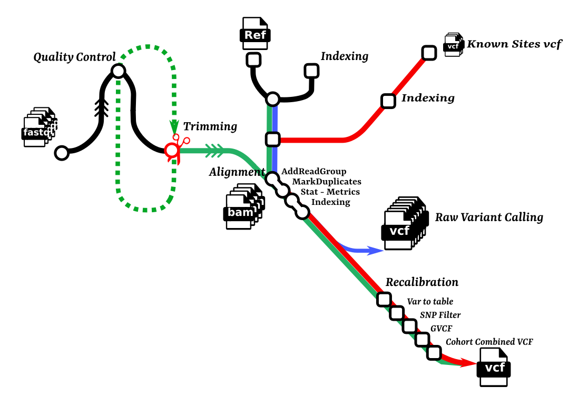

## DelMoro 
---

**DelMoro** is a workflow designed to detect variants on whole Genome- Exome sequencing data. It is built using Nextflow, a workflow tool to run tasks across multiple compute infrastructures. The pipeline is designed for detecting genetic variants, and it may be analyses SNPs for different spicies. DelMoro uses Conda/Mamba which makes installation trivial and results highly reproducible, Docker and Singularity containers are underconstruction.

---
### Workflow

---
1- To Run DelMoro first create using conda Delmoro Environment : 
~~~
conda env create -f DelMoro.yml && conda activate DelMoro
~~~
2- To check Delmoro commands :  
~~~
nextflow main.nf 
~~~
3- Error Handling : If you typed wrongly any params, an Error message will appear.

4- To See Defauls Params : 
~~~
nextflow main.nf --exec ShowParams
~~~

DelMoro offers for users the possibility of generating automatically required CSVs files for its processes. As an initial step, the USER prepares an input csv to write downstream CSVS.
~~~
nextflow main.nf --generate CSV --basedon CSVs/1_samplesheetForRawQC.csv 
~~~
The **1_samplesheetForRawQC.csv**  must be as the bellow template 
~~~
patient_id,R1,R2
AO22K1,./Data/DEL_1.fastq.gz,./Data/DEL_2.fastq.gz
TOK2W0,./Data/MORO_1.fastq.gz,./Data/MORO_2.fastq.gz
3OL51K,./Data/TUN_1.fastq.gz,./Data/TUN_2.fastq.gz
~~~
outputs of generated CSVs are as bellow : 

- *2_SamplesheetForTrimming.csv*
~~~
patient_id,R1,R2,MINLEN,LEADING,TRAILING,SLIDINGWINDOW
AO22K1,./Data/DEL_1.fastq.gz,./Data/DEL_2.fastq.gz,36,30,30,'4:20'
TOK2W0,./Data/MORO_1.fastq.gz,./Data/MORO_2.fastq.gz,36,30,30,'4:20'
3OL51K,./Data/TUN_1.fastq.gz,./Data/TUN_2.fastq.gz,36,30,30,'4:20'
~~~
 
- *3_samplesheetForAssembly.csv*

~~~
patient_id,R1,R2
AO22K1,./outdir/TrimmedREADS/DEL_1.fastq,./outdir/TrimmedREADS/DEL_2.fastq
TOK2W0,./outdir/TrimmedREADS/MORO_1.fastq,./outdir/TrimmedREADS/MORO_2.fastq
3OL51K,./outdir/TrimmedREADS/TUN_1.fastq,./outdir/TrimmedREADS/TUN_2.fastq
~~~
- *4_samplesheetForBamFiles.csv*
~~~
patient_id,BamFile
AO22K1,./outdir/Mapping/AO22K1_sor@RG@MD.bam
TOK2W0,./outdir/Mapping/TOK2W0_sor@RG@MD.bam
3OL51K,./outdir/Mapping/3OL51K_sor@RG@MD.bam
~~~
5- To Modify any params e.g. Threads which refers to cpus, type 
~~~
nextflow main.nf --exec Trim --cpus 10
~~~

6- CAll SNP : the pipeline generates by default vcf files, select SNP for all inputs and a cohorte GVCF  . 
~~~
nextflow main.nf --cpus 8 --exec CallSNP 
~~~
  * In case you wanna only generate vcf for all input add the parameter --generate
~~~
nextflow main.nf --cpus 8 --exec CallSNP --generate onlyVCF
~~~
  * In case you wanna generate a cohorte GVCF 
~~~
nextflow main.nf --cpus 8 --exec CallSNP --generate cohorteGVCF
~~~
---
The user have the ability to run each step by specifying parameter ( inputs and outputs ) or to prepare a params.json file as bellow : To use nextflow.config with its profiles, It is recommended to use **params.json** with specifting the desired profile .
~~~
 nextflow main.nf -params-file params.json -c nextflow.config -profile mamba --cpus 6 --exec IndexRef 
~~~ 

 - params.json 
 
~~~
{
	"basedon"	: "./CSVs/1_samplesheetForRawQC.csv",  		 
	"refGenome"	: "./Reference_Genome/reference.fa",		 

	"RawReads"	: "./CSVs/1_samplesheetForRawQC.csv", 		 
	"ToBeTrimmed"	: "./CSVs/2_SamplesheetForTrimming.csv",		 
	"ToBeAligned"	: "./CSVs/3_samplesheetForAssembly.csv",		 
	"BamFiles"	: "./CSVs/4_samplesheetForBamFiles.csv",  			 

	"knownSite1"	: "./knownsites/1000g_gold_standard.indels.filtered.vcf", 	 
	"knownSite2"	: "./knownsites/GCF.38.filtered.renamed.vcf",			

	"BamIndex"	: "./outdir/Indexes/BamFiles/*.bai",					   	  

	"ALIGNERIndex"	: "./outdir/Indexes/Reference/reference.fa.{0123,amb,ann,bwt.2bit.64,pac}",          
	"DictGATK"	: "./outdir/Indexes/Reference/reference.dict",				        
	"SamtoolsIndex"	: "./outdir/Indexes/Reference/reference.fa.fai",  			              

	"KnSite1Idx"	: "./outdir/Indexes/knownSites/1000g_gold_standard.indels.filtered.vcf.idx",    
	"KnSite2Idx"	: "./outdir/Indexes/knownSites/GCF.38.filtered.renamed.vcf.idx",		   

	"cpus"		: 4,
	"outdir"	: "./outdir",

	"generate"	: null
}
~~~

