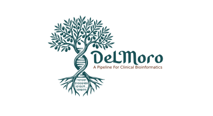
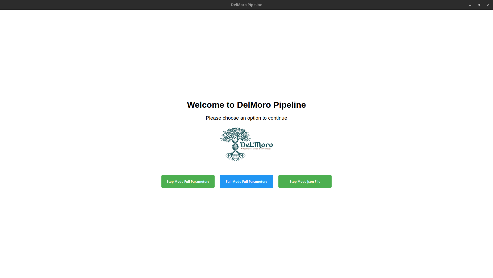

---

## Introduction 

DelMoro is a Nextflow pipeline for genome/exome variant detection across species specifically used in Human clinical genomics, offering two modality executions. As it can be executed as a complete end-to-end workflow or as a collection of independent analysis modules : (I) stepmode for modular execution of 9 subworkflows and (II) fullmode for automated end-to-end analysis.

The complete list of software used by DelMoro, together with the corresponding citations, is provided in [TOOLS.md](./TOOLS.md).

##  Usage

> [!WARNING]
> Please use Nextflow v25.x or earlier. The pipeline is not compatible with Nextflow v26.x. or later.
---

Detailed documentation, including installation instructions, pipeline configuration, input requirements, and execution examples, is available at: [documentation link]()

---

> [!NOTE]
> Please make sure to check help menu with `--help` before running the workflow on actual data.

~~~bash
 nextflow run main.nf --help
~~~

~~~
Usage   : nextflow run main.nf <modality> [--exec <module>] <params>

Modality: - --fullmode  : Executing   full   mode from fastq until vaiant calling.
          - --stepmode  : Executing   different   modules   in   standalone  mode.
~~~

#### Executing fullmode :  
~~~
nextflow run main.nf  
    --fullmode
    --input  
    --reference   | [--igenome ]   
    [--aligner bwamem2]  
    [--bqsr]  
    [--knownsite1 ,--knownsite2 |--ivcf1 ,--ivcf2 ]
    [--caller deepvariant ]
    [--mode cohort]  

~~~

#### Executing stepmode :  

~~~
nextflow run main.nf  
    --stepmode
    --exec <module>   

Module  : - rawqc       : Check           quality      of     raw           reads. 
          - trim        : Remove low-quality bp and adapters & checks its quality.
          - refidx      : Index   the    reference   genome    for      alignment.
          - align       : Align     reads      to     the     reference    genome.
          - bqsr        : Base          Quality         Score       recalibration.
          - callvar     : Detect          Variants   from      aligned      reads.
          - annotate    : annotate                  vfc                      file.
          - reporting   : Auto          Generate   PDF    of      vcf     reports.   
          - filter 	    : Filter  	vcfs  	     to      SNP      and      INDELS.                                                                                                                                      
          - help                                                                                                                                                                                                           
          - version 
~~~

## Graphical User Interface
DelMoro graphical user interface (GUI) is available in the [Releases section](https://github.com/othmanResearch/DelMoro/releases/tag/GUI-v1.0.0-2026.08.01) of this repository. To use it, download the [executable GUI file](https://github.com/othmanResearch/DelMoro/releases/download/GUI-v1.0.0-2026.08.01/DelMoro-UI).

## Citations 
If you use this pipeline in your research, please cite this GitHub repository.

> Zemzem, F., H'mida, D., & Othman, H. (2026). DelMoro : A Nextflow Pipeline for Variant Calling and  Streamlined Reporting in Clinical Genomics (Version 1.0.0) [Computer software]. https://github.com/othmanResearch/DelMoro 

~~~bash
@software{Zemzem_DelMoro_A_2026,
author = {Zemzem, Firas and H'mida, Dorra and Othman, houcemeddine},
month = aug,
title = {{DelMoro : A Nextflow Pipeline for Variant Calling and  Streamlined Reporting in Clinical Genomics}},
url = {https://github.com/othmanResearch/DelMoro},
version = {1.0.0},
year = {2026}
}
~~~

## Licence
