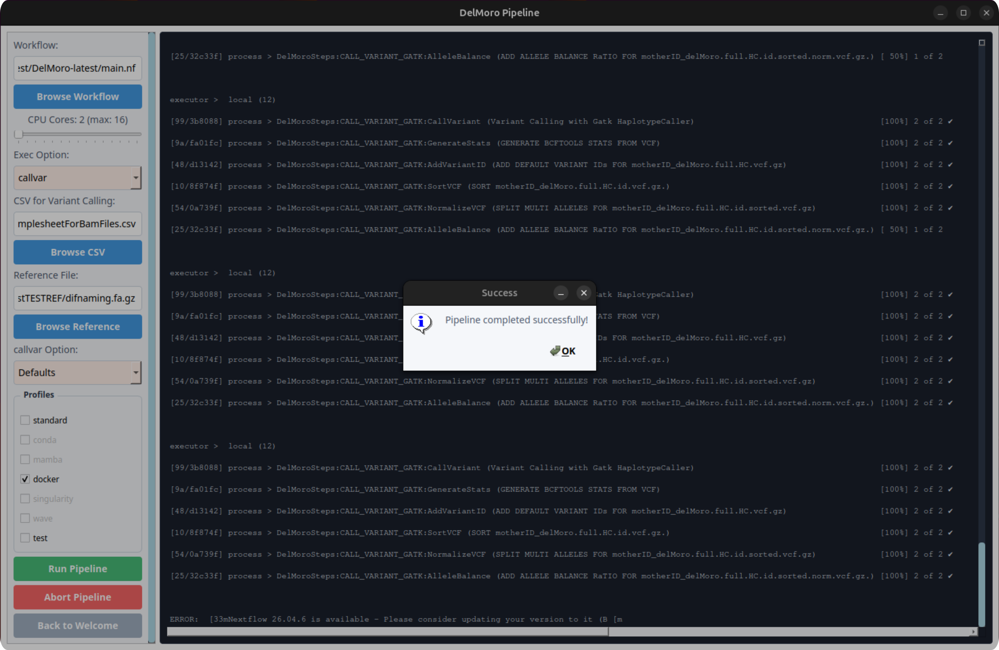

# Graphical User Interface for DelMoro Pipeline

## Introduction

This is the source code of DelMoro GUI developed using PyQt5 to simplify the execution of a Nextflow main script.

>[!IMPORTANT]
> The pipeline could be executed both using command-line or using the GUI by configuring the required parameters, selecting input files, launch the pipeline, and monitor its execution.


## How Does the GUI Interact with Nextflow

The main interface provides access to:

* Input file selection
* Pipeline parameter configuration
* Pipeline execution
* Execution progress
* Nextflow logs and messages
* Output and result information

The application acts as a bridge between the user and the Nextflow workflow:

```mermaid
flowchart LR
    A([User]) --> B[PyQt5 GUI]

    B --> C[Select Inputs]
    B --> D[Configure Parameters]
    B --> E[Execution Features]

    C --> F[Run Pipeline]
    D --> F
    E --> F

    F --> G[Monitor Execution]
    G --> H[View Logs & Status]
    G --> I[View Results]

    classDef user fill:#E8F1F8,stroke:#2C5F7C,stroke-width:2px,color:#173B4D;
    classDef gui fill:#EAF4EA,stroke:#4A7C59,stroke-width:1.5px,color:#23412B;
    classDef action fill:#F4EAF7,stroke:#7A4E8A,stroke-width:1.5px,color:#40274A;

    class A user;
    class B,C,D,E,G,H,I gui;
    class F action;
````

## Usage

DelMoro graphical user interface (GUI) is available in the [Releases section](https://github.com/othmanResearch/DelMoro/releases/tag/GUI-v1.0.0-2026.08.01) of this repository. To use it, download the [executable GUI file](https://github.com/othmanResearch/DelMoro/releases/download/GUI-v1.0.0-2026.08.01/DelMoro-UI).

>[!TIP]
> User could only downloadthe `EXECUTABLE` DelMoro-GUI, than downloading the whole source code.

>[!NOTE]
> If Using only Nextflow standard profile, please ensure to activate DelMoro profile before launching the GUI, or Simply use other profiles.

