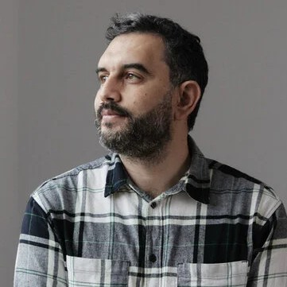

# About

    

        
This documentation provides an overview of the DelMoro pipeline, including its purpose, architecture, workflow, configuration and execution requirements.
            Supported by Docker, Singularity, Wave, and Conda environments, DelMoro ensures easy deployment across diverse systems. With an option of   integrating a graphical user interface built with PyQt, allowing users to configure and run analyses without requiring command-line expertise.
    
    

## License & copyright
- 
## Roles & Responsibilities
The project follows a collaborative development approach. Team members contribute through code development, review, testing, documentation, and continuous improvement.

    

        <a href="https://www.researchgate.net/profile/Firas-Zemzem" target="_blank" rel="noopener noreferrer"> 
            
<strong>Mr. Firas Zemzem </strong>  PhD Candidate in Bioinformatics   Nextflow Ambassador 

        </a>
    

    

        <a href="https://www.researchgate.net/profile/Houcemeddine-Othman" target="_blank" rel="noopener noreferrer"> 
            
<strong>Dr. Houcemeddine Othman</strong>  Assistant Professor of Bioinformatics   Nextflow Ambassador 

        </a>
    

## Laboratory Support

    

    
The project is carried out with the support of Laboratory of Human Cytogenetics, Molecular Genetics and Reproductive Biology, Farhat Hached University Hospital, University of Sousse, Sousse, Tunisia. The project is developed with the guidance of <a href="https://www.researchgate.net/profile/D-Hmida-Ben-Brahim"> Pr. H’mida-Ben Brahim</a>, who provides scientific advice and contributes to the overall direction of the project.

    

## Contact

    

        
 For questions, issues, or contributions related to the pipeline, you can contact the project team directly:
            <a href="mailto:houcemoo@gmail.com" target="_blank">Dr. Houcemeddine Othman</a>
            and/or
            <a href="mailto:zemzemfiras@gmail.com" target="_blank">Mr. Firs Zemzem</a>
        
 For technical issues, bug reports, or feature requests, feel free to <a href="https://github.com/othmanResearch/DelMoro/issues" target="_blank"> open an issue</a> on the DelMoro's GitHub repository.

