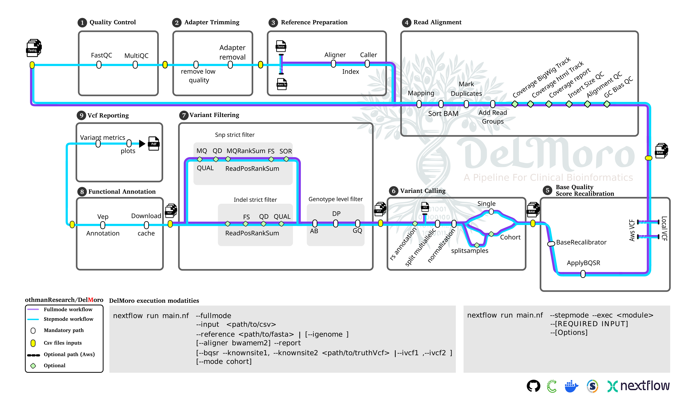

# Workflow Structure 

<b>DelMoro</b> operates in two operational modes <b>stepmode</b> and <b>fullmode</b>. 

The full mode is designed to run the workflow with minimal user intervention, requiring the user to focus primarily on ensuring the quality of the input data. This mode follows a hands-off approach, handling all downstream processes automatically. 
 

In step mode, users can execute individual stages of the workflow independently. This mode is particularly useful for targeted tasks such as performing variant calling from pre-aligned BAM files, annotating existing VCF files, or debugging specific workflow components. 

-  

## Stepmode
**Stepmode** decomposes the workflow into **eight discrete, sequential subworkflows**, allowing users to execute, customize, and refine each stage independently.

### Subworkflows
1. **Raw Read Quality Control** – Assess sequencing read quality prior to downstream processing.
2. **Adapter Trimming** – Remove sequencing adapters using a selectable trimming algorithm.
3. **Reference Genome Indexing** – Prepare genome index files for efficient alignment.
4. **Read Alignment** – Map reads to the reference genome using **BWA** or **BWA-MEM2**.
5. **Base Quality Score Recalibration (BQSR)** – Adjust quality scores for improved variant calling accuracy.
6. **Variant Calling** – Identify genomic variants from aligned reads.
7. **Functional Annotation** – Interpret variants with an annotation process split into:
   - **Cache Preparation** (for reproducibility and offline use)
   - **Variant Annotation** (functional characterization of variants)
8. **Report Generation** – Produce summaries, metrics, and optional **depth-coverage visualizations**.

### Key Features
- **Fine-grained control** over each step.
- **Method selection** (e.g., trimming algorithms, alignment tools).
- **Optional outputs** (e.g., coverage depth plots).
- **Isolated execution** of individual components.

## Fullmode
**Fullmode** consolidates all pipeline steps into a **single, integrated execution**, ensuring maximum automation while preserving configurable parameters.

### Characteristics
- End-to-end processing from raw reads to final annotated report.
- Configurable parameters for:
  - Reference genome sourcing
  - Alignment methodology (**BWA** or **BWA-MEM2**)
  - Optional BQSR inclusion
- Suitble for production phases in high-throughput sequncing analyses.

## Workflow Adaptability & Example Use Cases
 
**Stepmode** is best suited for **iterative refinement** and **developmental genomics**, where individual stages may require repeated tweaking.  
Typical use cases include:
- Testing or rechecking multiple samples without re-running upstream processes.
- Adjusting trimming thresholds for challenging datasets.
- Re-annotating variants with updated databases.

**Fullmode** is optimized for **production-grade, reproducible analyses** with minimal manual intervention.  
Typical use cases include:
- Clinical pipelines requiring standardized, reproducible runs.
- Population-scale variant discovery projects.
- High-throughput genomics where automation is critical.
